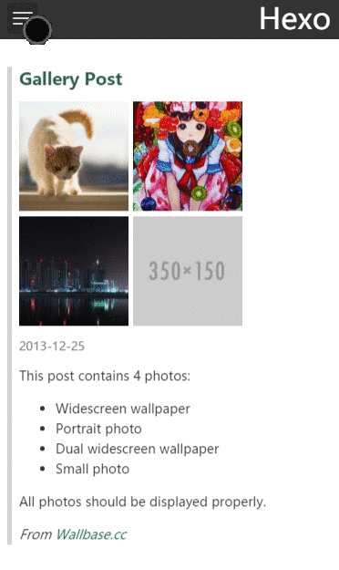
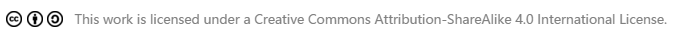

# hexo-theme-chan
A super simple and elegant theme for [hexo](http://hexo.io). Chan is '禪' in Chinese, which means a lot but presents simply. Less is more. [Preview](http://denjones.github.io/hexo-theme-chan/archives/)

## Screenshot




## Usage

``` shell
git clone https://github.com/denjones/hexo-theme-chan.git themes/chan
```

And set your theme to `chan` in your site `_config.yml` file.

Before deploying your site, you may need to run `hexo clean` to clean the cache:

``` shell
hexo clean
hexo deploy
```

## Browser
Only support the latest browsers. May work in the older ones but never tested.

## Features

feature list:
 - grayscale style
 - responsive design
 - inline gallery photos
 - photoswipe gallery
 - creative commons 4.0 supports
 - customizable sidebar link
 - duoshuo, disqus, jiathis supports
 - languages: en, zh-CN, zh-TW

### Monochrome

We use a grayscale style to present photos and articles in desktop view. If you don't like it, you can disable it in the theme [_config.yml](_config.yml) file.

### FancyBox / PhotoSwipe

Many people use [FancyBox](https://github.com/fancyapps/fancyBox) in their hexo sites, but the FancyBox project is no longer maintained since 2013. In this theme we use [PhotoSwipe](http://photoswipe.com/) instead of FancyBox, and keep FancyBox tag usable (Did some tricks to the FancyBox tag to use PhotoSwipe), so you don't have to modify your post :).

``` md


```

To use PhotoSwipe with gallery post, you may also set the caption and the dimension of a photo in the front matter with a `photoInfos` property which is a list of info with the same order as the corresponding photo:

``` yml
title: Gallery Post
date: 2013-12-25 00:16:18
photos:
- /assets/wallpaper-2572384.jpg
- /assets/wallpaper-2311325.jpg
- /assets/wallpaper-878514.jpg
photoInfos:
-
  caption: A Cat
  width: 1920
  height: 1200
-
  caption: A Girl
-
  caption: A City with Long Caption Like This
```

### Creative Commons
We suggest using [Creative Commons 4.0 International](https://creativecommons.org) to protect your works. Once a cc front matter is set, a CC hint would be shown after the post:



Take a look at the theme [_config.yml](_config.yml) for more details.

### Language
Currently we support the following languages:
 - en
 - zh-CN
 - zh-TW

According to a default language selecting bug in hexo [#1125](https://github.com/hexojs/hexo/issues/1125), you should set an exact language in the site `_config.yml` file rather than leaving it blank, or there may be inconsistence in languages in the view.

## Settings

All settings are well documented in the [_config.yml](_config.yml) file, please check it out.
